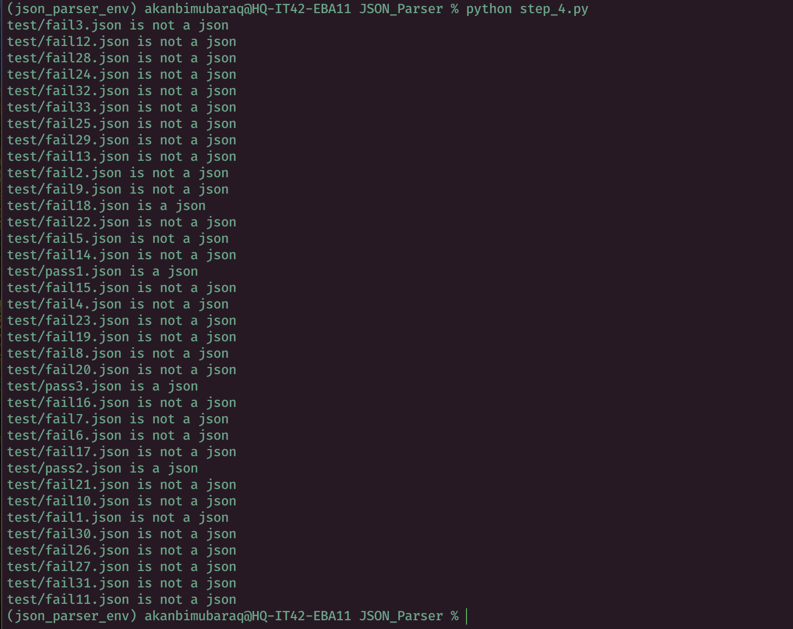

A JSON Parser implementation in Python from [John Cricket coding challenges](https://codingchallenges.fyi/challenges/challenge-json-parser/)

# WC Tool implementation in Python


A simple implementation of a JSON Parser written in Python.
Part of my attempt at John Crickett's [Coding Chanllenges](https://codingchallenges.fyi/challenges/challenge-json-parser/)

## Features

- Basic implementation of JSON Parser to parse a simple JSON object containing string keys and string values.
- Basic implementation of JSON Parser to parse a simple JSON object containing string, numeric, boolean and null values.
- Basic implementation of JSON Parser to parse a simple JSON object with object and array values.
- Support for automating the tests so you can run them repeatedly.

## Installation

1. Clone the repository:

   ```bash
   git clone https://github.com/olartbaraq/John_Crickett_Coding_Challenge.git
   cd JSON_Parser
   ```

## Usage

1. Run the JSON_Parser :

   ```bash
   python step4.py
   ```

## Basic example


